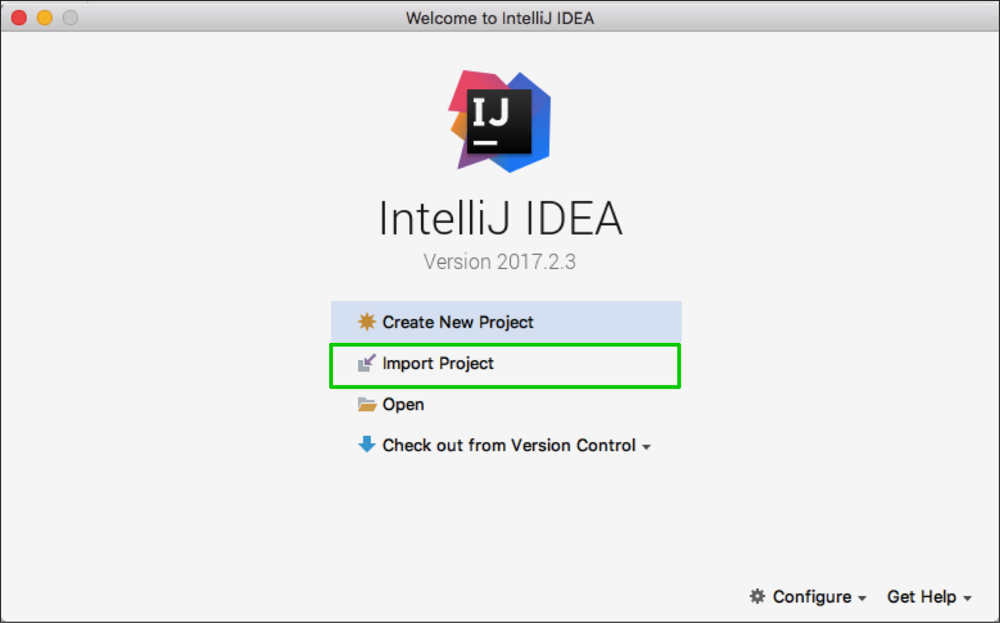
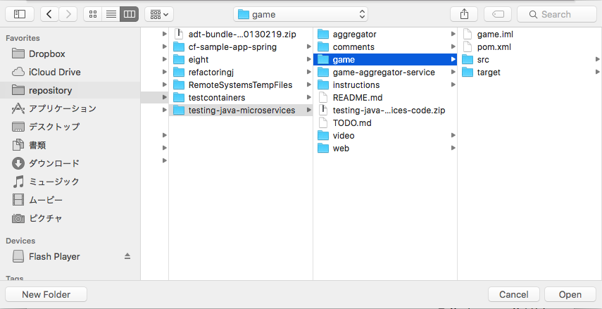
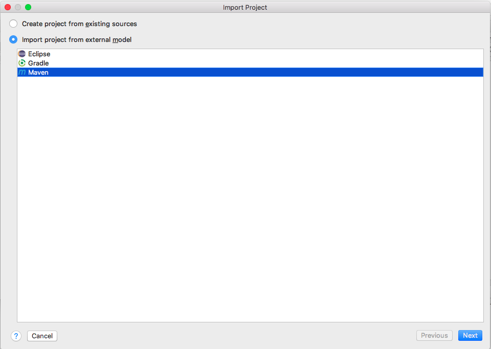

Here are instructions how to run projects with IntelliJ IDEA.

# Import Projects
You need to import each subproject separatedly.

1. Start IntelliJ IDEA.
2. Choose "Import Project".

3. Specify each subproject.

4. Choose the proper model (Gradle or Maven).

5. Finish with default parameters.
